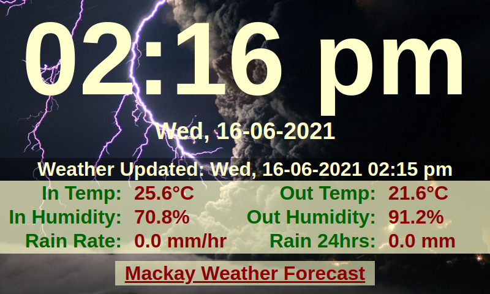
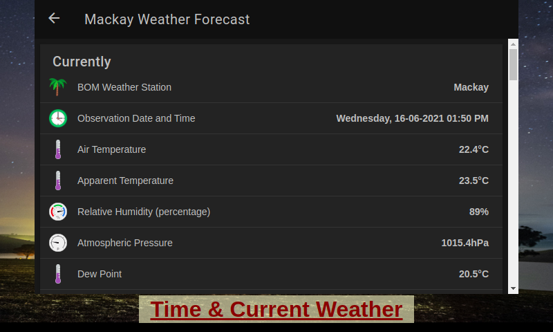

# RPi_TimeMachine
Clock and Weather display

- A simple Clock and Weather display for Raspberry Pi with 5" 800 x 480 LCD.

- /html/index.html should be a symlink to /html/date-time-weather.html, somehow GitHub can't handle symlinks. Added script (setPerms+Symlink.sh) to set permissions and create the symlink.

- /html/images is the directory for the background images (wallpapers), I think mine are free but can't be sure so haven't included them, see README in that directory for more info.

- For /html/weather-current.html, must have a Websockets enabled MQTT server running that can supply local weather information (I use a custom weewx server with weewx-mqtt to supply the mqtt data to my MQTT server).

- Not sure on the restrictions to importing data to /html/weather-forecast.html, I use an OpenHAB3 forecast page, but I suppose any external URL will also work (though untested).

- The bottom Underlined texts in following screenshots are links are to the other page (two pages in total).

- All changes now referenced in CHANGELOG

Screenshots:

